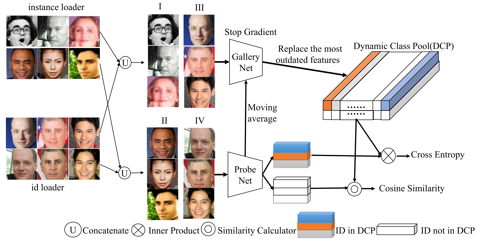

# Fast Face Classification (F²C)—— An Efficient Training Approach for Very Large Scale Face Recognition (CVPR2022)
                          Kai Wang*, Shuo Wang*, Panpan Zhang, Zhipeng Zhou, Zheng Zhu, Xiaobo Wang, Xiaojiang Peng, 
						   Baigui Sun, Hao Li
							 Yang You
                  National University of Singapore, Alibaba DAMO Academy, Tsinghua University, Institute of Automation, Chinese Academy of Sciences, Shenzhen Technology University
			        Kai Wang and Shuo Wang are equally-contributted authors
***Abstract***
Training on ultra-large-scale datasets is time-consuming and takes up a lot of hardware resource. Therefore so we design a dul-data loaders and dynamic class pool to deal with large-scale face classification. For more details, please refer to our [paper](https://arxiv.org/pdf/2105.10375.pdf)

***Pipeline***


### Preparation
As FFC contains LRU module, so you may use lru_python_impl.py or instead 
compile the code under lru_c directory. 

If you choose lru_python_impl.py, you should rename lru_python_impl.py to lru_utils.py.
As lru is not the bottleneck of the training procedure, so feel free to use python implementation, though
the C++ implementation is 5~10 times faster than python version.

#### Compile LRU (optional)
Command to build LRU
``` shell
cd lru_c
mkdir build
cd build
cmake ..
make
cd ../../ && ln -s lru_c/build/lru_utils.so .
```
You can compare this two implementation using lru_c/python/compare_time.py
### Database
* Training dataset

     * [MS-Celeb-1M](https://github.com/deepinsight/insightface/tree/master/challenges/iccv19-lfr)

     * [Deepglint-360K](https://github.com/deepinsight/insightface/tree/master/recognition/partial_fc#Glint360K)

* Test dataset
    * [SLLFW](http://whdeng.cn/SLLFW/pair_SLLFW.txt)
    * CPLFW: [Baidu](https://pan.baidu.com/s/1i6iHztN)  or [Google Drive](https://drive.google.com/file/d/1aInOZtuvKkiV-Gtitcv1-daZshL-8PAE/view?usp=sharing)
    * CALFW: [Baidu](http://pan.baidu.com/s/1ge6wFuV) or [Google Drive](https://drive.google.com/file/d/1_cYgy7VFCy6JqkR8EvOxCVS02jHN1ozm/view?usp=sharing)
    * CFP: [Baidu](https://pan.baidu.com/s/1lID0Oe9zE6RvlAdhtBlP1w) or [Google Drive](https://drive.google.com/file/d/13MPwlCqjiO6OqZWQkyHl0CjcJa4UEnEy/view?usp=sharing)
    * AgeDB: [Baidu](https://pan.baidu.com/s/1vf08K1C5CSF4w0YpF5KEww) or [Google Drive](https://drive.google.com/file/d/15el0xh5E6tSYJQ1KurAGgfggNjqg_t6d/view?usp=sharing)
    * [YTF](https://www.cs.tau.ac.il/~wolf/ytfaces/index.html#download)
    * [IJBC](https://nigos.nist.gov/facechallenges/data/IJBC/IJB-C_Protocols_update.tar.gz)
    * [MegaFace](http://megaface.cs.washington.edu/)
  
* Data preprocess

  We use 5 landmarks(Left eye center, right eye center, nose, left mouth corner and right mouth corner) to crop face as what [ArcFace](https://github.com/deepinsight/insightface) does. You can find code [here](https://github.com/JDAI-CV/FaceX-Zoo/blob/37c1e27c5833bf3bfc4dc4e68e2fa01380d6609b/face_sdk/core/image_cropper/arcface_cropper/FaceRecImageCropper.py#L95).

### Training
In main.py, you should provide the path to your training db at line 152-153.
```Python
args.source_lmdb = ['/path to msceleb.lmdb']
args.source_file = ['/path to kv file']
```

We choose lmdb as the format of our training db. Each element in ``source_file`` is the path to a text file, each line of which represents ```lmdb_key label``` pairs. 
You may refer to [LFS](https://github.com/tiandunx/loss_function_search) 
for more details.


Now you can modify train_ffc.sh. Before running the training, you should set the port number and queue_size.
``queue_size`` is a trade-off term that controls the performance and the speed. Larger ```queue_size``` means higher performance at the cost of time and GPU resource.
It can be any positive integer. The common setting is 1%, 0.1%, 0.001 % of the total identities.

### Notice
The difference between r50 and ir50 is that r50 requires 224 × 224 images as input while [ir50](https://github.com/deepinsight/insightface/tree/master/recognition/arcface_torch/backbones) requires 112 × 112 as what does by [ArcFace](https://github.com/deepinsight/insightface). The network ir50 comes from ArcFace. 
### Evaluation
We provide the whole test script under evaluation_code directory. Each script requires the directory to the images and test pair files. 

### Citing FFC
If you use this code in your research, please cite:
```
@inproceedings{FFC2022,
  title={An Efficient Training Approach for Very Large Scale Face Recognition},
  author={Kai Wang, Shuo Wang, Panpan Zhang, Zhipeng Zhou, Zheng Zhu, Xiaobo Wang, Xiaojiang Peng, Baigui Sun, Hao Li and Yang You},
  booktitle={CVPR},
  year={2022}
}
```

***__Tips__***

Code in ```evaluation_code/test_megaface.py``` is much ***faster*** than official version. It's also applicable to extremely large-scale testing.
